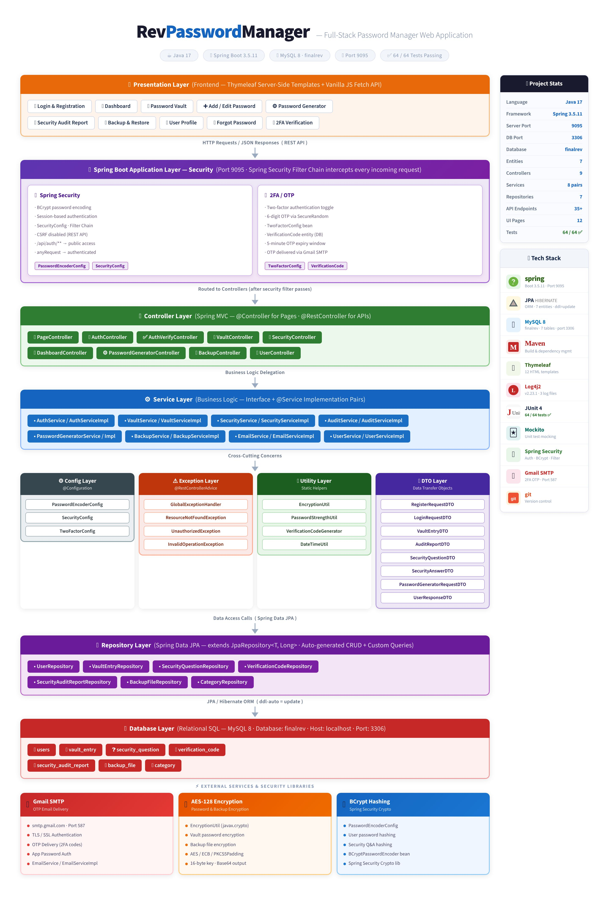
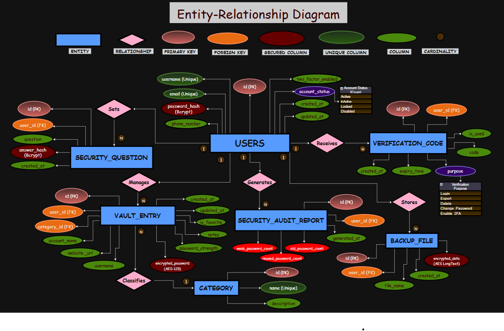

# 🔐 RevPasswordManager


A **secure password management web application** built using **Java Spring Boot**.
RevPasswordManager allows users to **store, generate, and manage passwords securely** using modern authentication and encryption mechanisms.

This project demonstrates **enterprise-level backend architecture, security best practices, and full-stack development concepts**.

---

# 🧠 Key Features

## 🔑 Authentication System

* Secure user registration
* Login authentication
* BCrypt password encryption
* Session management

## 🗄 Password Vault

* Store credentials securely
* View stored passwords
* Manage password entries
* Secure database storage

## 🔐 Password Generator

* Generate strong random passwords
* Custom password length
* Secure character combinations

## 🛡 Security Features

* Spring Security authentication
* Password encryption
* Secure controller access
* Session protection

## 🔄 Backup & Security

* Credential backup
* Security audit capability

---

# 🛠 Tech Stack

### Backend

* Java
* Spring Boot
* Spring Security

### Frontend

* HTML
* CSS
* Thymeleaf

### Database

* MySQL

### Build Tool

* Maven

---

# 🏗 System Architecture

The following diagram illustrates the layered architecture of **RevPasswordManager**, including the presentation layer, security layer, controllers, services, repositories, and database.

<p align="center">

</p>

Architecture Layers:

* Presentation Layer (Thymeleaf UI)
* Spring Security Layer
* Controller Layer
* Service Layer
* Repository Layer
* Database Layer

---

# 🗄 Database ER Diagram

The following Entity Relationship Diagram shows how the database entities interact with each other.

<p align="center">

</p>

### Main Entities

* Users
* Vault Entry
* Security Question
* Verification Code
* Backup File
* Security Audit Report
* Category

---

# 📂 Project Structure

```
RevPasswordManager
│
├── src/main/java/com/revpasswordmanager
│   ├── controller
│   ├── service
│   ├── repository
│   ├── model
│   ├── dto
│   └── config
│
├── src/main/resources
│   ├── templates
│   ├── static
│   └── application.properties
│
├── pom.xml
└── README.md
```

---

# ⚙ Installation & Setup

## Clone the Repository

```bash
git clone https://github.com/Jagadesh8147/RevPasswordManager-2.git
```

## Navigate to the Project

```bash
cd RevPasswordManager
```

## Build the Application

```bash
mvn clean install
```

## Run the Application

```bash
mvn spring-boot:run
```

---

# 🌐 Application Access

Open in browser:

```
http://localhost:8147
```

---

# 🔐 Security Implementation

* BCrypt Password Encryption
* Spring Security Authentication
* Session Management
* Secure Controller Authorization
* Strong Password Generation

---

# 🚀 Future Enhancements

* Password Strength Meter
* Email OTP Authentication
* Cloud Backup
* Mobile Responsive UI
* Browser Extension Integration

---

# 👨‍💻 Author

**Jagadesh Sai**

Java Full Stack Developer

---

# ⭐ Support

If you like this project, please ⭐ the repository.
